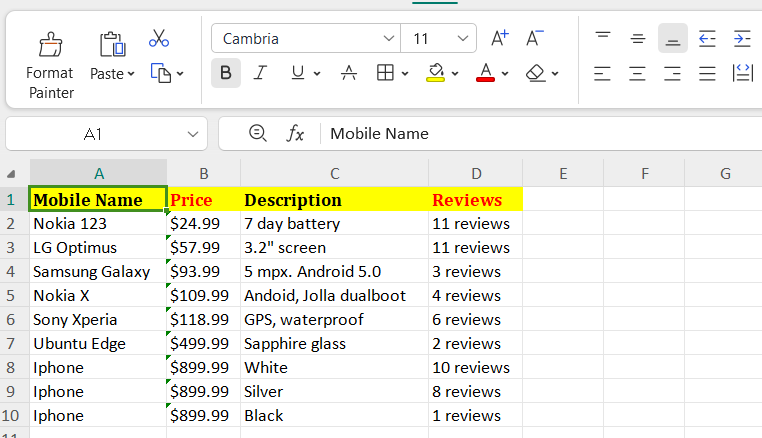

#  E-Commerce Product Data Scraper

A robust and clean **Python Web Scraper** built using `BeautifulSoup` and `Pandas`. This automated tool extracts e-commerce product listings—including product names, prices, descriptions, and user reviews—and exports the structured data into a polished Microsoft Excel spreadsheet (`.xlsx`).

---

##  Output Preview

Below is the screenshot of the cleaned data exported to Excel:



---

##  Features

- **Automated Data Extraction:** Scrapes product details seamlessly using custom HTTP headers to avoid standard bot filters.
- **Data Structuring:** Cleans raw HTML text and structures it into four key attributes:
  -  **Mobile Name**
  -  **Price**
  -  **Description**
  -  **Reviews**
- **Excel Export:** Uses `Pandas` and `OpenPyXL` to generate a ready-to-use `.xlsx` file.
- **Error Handling:** Fallback logic for missing elements to ensure smooth execution without breaking loops.

---

## Tech Stack & Libraries

- **Language:** Python 3.x
- **Web Scraping:** `BeautifulSoup4`, `Requests`
- **Data Manipulation & Export:** `Pandas`, `OpenPyXL`

---

##  How to Run locally

### 1. Clone the Repository
```bash
git clone [https://github.com/YOUR_GITHUB_USERNAME/ecommerce-product-scraper-python.git](https://github.com/YOUR_GITHUB_USERNAME/ecommerce-product-scraper-python.git)
cd ecommerce-product-scraper-python
